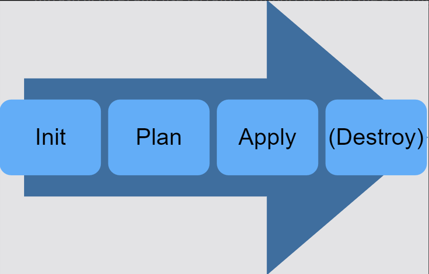

# What is Infrastructure as Code?

<figure><figcaption>
Infrastructure as Code
</figcaption></figure>

**Understanding Infrastructure:** Infrastructure is the backbone of applications, traditionally comprising servers, storage, and networking. Virtualization further divides servers into physical and virtual machines, while cloud providers offer IaaS, PaaS, and SaaS.

**Introduction to Infrastructure as Code (IaC):** IaC involves defining and setting up resources through machine-readable code. It covers servers, virtual machines, networking, storage, and databases, applicable beyond the cloud if there's a programmatic interface.

**IaC Formats: Declarative and Imperative:** IaC comes in declarative (outcomes) and imperative (process) formats. Tools like Terraform focus on the end state, while batch scripts describe the process and may reference a configuration file.

**Storing and Managing IaC Code:** IaC code is stored in version control for change tracking and collaboration. It integrates with software practices like testing, deployment pipelines, and reusable components.

#### Key Points:

* Infrastructure is what apps run on.
* IaC automates infrastructure setup with machine-readable code.
* It works in any environment with a programmatic interface.
* IaC can be declarative or imperative.
* Code is stored in version control for tracking and collaboration.
* IaC aligns with common software practices.
* Infrastructure isn't provisioned manually; it's code-driven.
